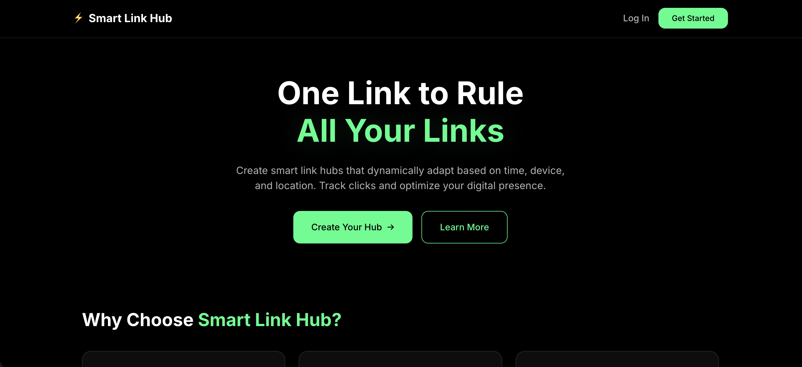
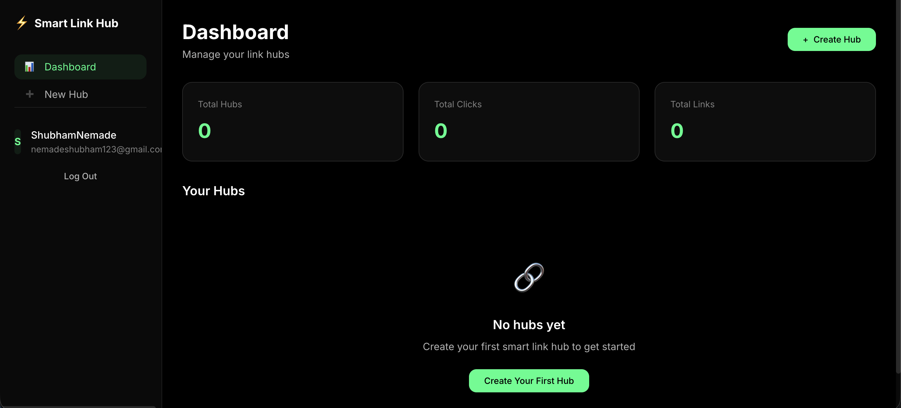
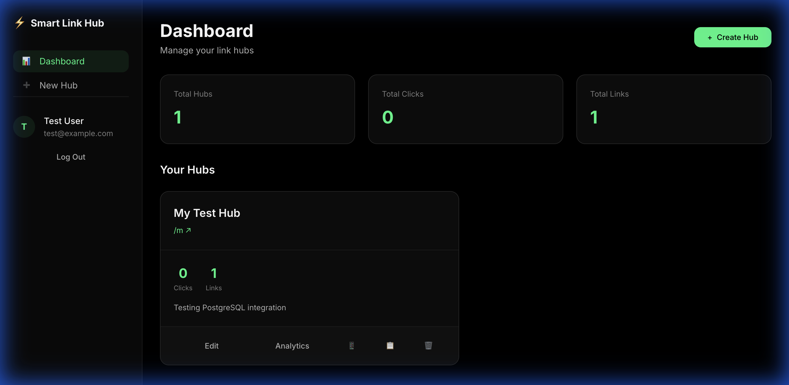

# ⚡ Smart Link Hub

A modern, full-stack link management platform for creating dynamic, personalized link pages with smart display rules, real-time analytics, and QR code generation.



## 🚀 Live Demo

- **Frontend**: [https://smart-link-hub-3fph.onrender.com](https://smart-link-hub-3fph.onrender.com)
- **Backend API**: [https://smart-link-hub-api.onrender.com](https://smart-link-hub-api.onrender.com)

## ✨ Features

### 📱 Link Hub Management
- Create unlimited personalized link pages
- Drag-and-drop link reordering
- Custom icons for each link
- Enable/disable links without deleting

### 🧠 Smart Display Rules
- **Time-based rules**: Show links only during specific hours
- **Device-based rules**: Display different links for mobile, tablet, or desktop users
- **Location-based rules**: Target links to specific countries

### 📊 Real-Time Analytics
- Track page views and link clicks
- Device breakdown visualization
- Interactive charts with daily/weekly/monthly views
- Export analytics data as CSV

### 🎨 Custom Themes
- Multiple built-in themes (Default, Midnight Purple, Ocean Teal, Sunset Red)
- Clean, responsive design

### 📲 QR Code Generation
- Generate QR codes for any hub
- Download as PNG
- Perfect for print materials

## 📸 Screenshots

### Dashboard


### Hub with Links Created


## 🛠️ Tech Stack

### Frontend
- **React 18** - UI framework
- **Vite** - Build tool
- **React Router** - Client-side routing
- **Vanilla CSS** - Custom styling with CSS variables

### Backend
- **Express.js** - Node.js web framework
- **PostgreSQL** - Database (production)
- **pg** - PostgreSQL client with connection pooling
- **QRCode** - QR code generation
- **UUID** - Unique ID generation
- **CORS** - Cross-origin resource sharing

### Deployment
- **Render** - Cloud hosting (Static Site + Web Service + PostgreSQL)

## 🏗️ Project Structure

```
smart-link-hub/
├── src/
│   ├── pages/
│   │   ├── Landing.jsx      # Home page
│   │   ├── Login.jsx        # Auth (login/register)
│   │   ├── Dashboard.jsx    # User dashboard
│   │   ├── HubEditor.jsx    # Create/edit hubs
│   │   ├── Analytics.jsx    # Analytics dashboard
│   │   └── PublicHub.jsx    # Public link page
│   ├── api.js               # API URL configuration
│   ├── App.jsx              # Main app with routing
│   ├── main.jsx             # Entry point
│   └── index.css            # Global styles
├── server/
│   └── index.js             # Express API server
├── screenshots/             # Project screenshots
├── package.json
└── vite.config.js
```

## 🚀 Getting Started

### Prerequisites
- Node.js 18+
- PostgreSQL (for local development)

### Installation

1. **Clone the repository**
   ```bash
   git clone https://github.com/Shubham-Nemade-24/Smart-Link.git
   cd Smart-Link
   ```

2. **Install dependencies**
   ```bash
   npm install
   ```

3. **Set up PostgreSQL database**
   ```bash
   createdb smartlinkhub
   ```

4. **Start the development servers**

   Terminal 1 - Backend:
   ```bash
   DATABASE_URL="postgresql://localhost/smartlinkhub" npm run server
   ```

   Terminal 2 - Frontend:
   ```bash
   npm run dev
   ```

5. **Open in browser**
   ```
   http://localhost:5173
   ```

## 📡 API Endpoints

### Authentication
| Method | Endpoint | Description |
|--------|----------|-------------|
| POST | `/api/auth/register` | Register new user |
| POST | `/api/auth/login` | Login user |

### Hubs
| Method | Endpoint | Description |
|--------|----------|-------------|
| GET | `/api/hubs` | Get all user hubs |
| POST | `/api/hubs` | Create new hub |
| GET | `/api/hubs/:id` | Get hub details |
| PUT | `/api/hubs/:id` | Update hub |
| DELETE | `/api/hubs/:id` | Delete hub |
| GET | `/api/hubs/:id/qr` | Generate QR code |

### Public
| Method | Endpoint | Description |
|--------|----------|-------------|
| GET | `/api/public/:slug` | Get public hub data |

### Analytics
| Method | Endpoint | Description |
|--------|----------|-------------|
| POST | `/api/analytics/track` | Track page view/click |
| GET | `/api/analytics/:hubId` | Get hub analytics |
| GET | `/api/analytics/:hubId/export` | Export analytics (CSV/JSON) |

## ☁️ Deployment on Render

### 1. Create PostgreSQL Database
- New → PostgreSQL → Free plan
- Copy the **Internal Database URL**

### 2. Deploy Backend (Web Service)
- Build: `npm install`
- Start: `npm start`
- Environment:
  - `NODE_ENV=production`
  - `DATABASE_URL` = Internal Database URL

### 3. Deploy Frontend (Static Site)
- Build: `npm install && npm run build`
- Publish: `dist`
- Environment:
  - `VITE_API_URL` = Backend URL

## 📝 Environment Variables

### Backend
| Variable | Description |
|----------|-------------|
| `DATABASE_URL` | PostgreSQL connection string |
| `NODE_ENV` | Environment (production/development) |
| `PORT` | Server port (default: 3001) |
| `FRONTEND_URL` | Frontend URL for CORS (optional) |

### Frontend
| Variable | Description |
|----------|-------------|
| `VITE_API_URL` | Backend API URL |

## 🤝 Contributing

1. Fork the repository
2. Create your feature branch (`git checkout -b feature/AmazingFeature`)
3. Commit your changes (`git commit -m 'Add some AmazingFeature'`)
4. Push to the branch (`git push origin feature/AmazingFeature`)
5. Open a Pull Request

## 📄 License

This project is open source and available under the [MIT License](LICENSE).

## 👤 Author

**Uday Patil**, 
**Shubham Nemade**, 
**Shivraj Patil**

---

⭐ Star this repo if you found it helpful!


